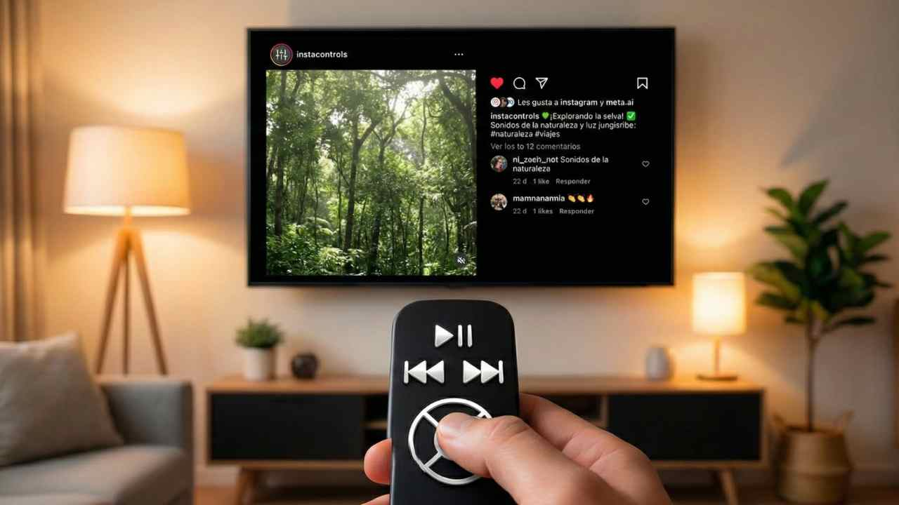

# InstaControls

  
   
  
  
  

**InstaControls** is a lightweight and powerful Chrome extension designed to enhance your Instagram experience. It enables native video playback controls, provides a local favorites system, and allows you to **download videos and photos** directly from your feed, stories, or reels.

## Features

- **Native Video Controls**: Enables the standard browser playback bar (play/pause, volume, fullscreen, playback speed) on any video.
- **Interactive Settings Popup**: Modern glassmorphic panel accessible from the extension icon to customize video seeking, auto-controls, shortcuts, and volume persistence.
- **Keyboard Shortcuts**: Control video playback by hovering your cursor over them:
  - `Left / Right Arrow`: Seek backward or forward.
  - `M`: Toggle mute/unmute.
  - `Spacebar`: Play/pause.
  - `P`: Toggle Picture-in-Picture window.
  - `F`: Toggle native fullscreen.
- **Smart Volume Persistence**: Remembers your preferred volume level across different posts, reels, and stories, filtering out Instagram's automatic background mute changes.
- **Local Favorites System**:
  - Save posts instantly by clicking the star icon on any image/video overlay.
  - Access saved content through a floating trigger button and a gorgeous slide-in sidebar.
  - Filter and group your favorites by creator, or view recent items.
  - **Batch Selection**: Multi-select saved posts to download or delete them simultaneously.
- **Advanced UI Customization (InstaControl Deluxe)**:
  - **Global Background System**: Upload a custom background image applied to the entire Instagram page, layered with customizable glassmorphic backdrop-blur and colored tints (Slate, Midnight, Forest, Pure Black). The sidebar remains neutral and dark for clean legibility.
  - **Typography & Font Scaling**: Apply premium fonts (Outfit, Inter, Montserrat, Poppins, Playfair Display) and adjust interface font scaling from XS to XL.
  - **Compact Mode**: Narrow the feed columns (450px) and crop tall assets for a highly optimized, scroll-friendly layout.
- **Universal Downloads**: Download **Videos** (Reels, Stories, Feed) and **Photos** in high quality.
- **Open in New Tab**: View direct source files instantly (or open the post page if the video is streamed via blob).
- **Secret Codes (Easter Eggs)**: Enter these secret strings in the "Código Secreto" field to transform the entire layout:
  - `matrix`: Spawns a cascade of falling digital rain code on a background canvas, turning text green and monospace.
  - `angine`: Applies a pitch-black background covered in a staggered grid of pulsing and zooming white dots.
  - `cyberpunk`: Glows text with pink/cyan neon flickers, sets a deep purple background, and increases media color grading saturation.
  - `retro` / `gameboy`: Switches text to an 8-bit game font (uppercase) on Game Boy green boxes, adding a flickering CRT scanline filter.
  - `ocean` / `aqua`: Animates floating bubbles rising randomly behind posts, applying a gentle watery wave oscillation.
  - `psychedelic` / `rainbow`: Rotates background hues continuously and triggers psychedelic wobbling on hovered articles.
  - `minecraft`: Styles posts as stone block boxes with 3D inset borders, sets text in VT323 pixel font, and replaces Instagram's hearts with **Minecraft hearts**.
  - `yt05`: Recreates YouTube's classic 2005 look with Arial font, blue links, red rounded logos, and replaces likes with **5-star rating stars**.
  - `instaold`: Recreates Instagram's classic 2011/2012 layout with the cursive white header logo, light-grey textured background, framed posts, and classic **blue heart likes**.
- **Reels & Stories Alignment**: Repositioned controls to outer safe zones (such as stories' side black bars) so they never overlap the content.

## Installation

1.  **Clone or Download** this repository.
2.  Open Google Chrome and go to: `chrome://extensions`
3.  Enable **"Developer mode"** (top right toggle).
4.  Click on **"Load unpacked"**.
5.  Select the project folder.

## How to Use

1.  Go to [Instagram.com](https://www.instagram.com).
2.  Browse your feed, stories, or reels.
3.  You will see new overlay icons on the media content:
    *   **Controls Button**: Toggle native video playback controls.
    *   **PiP (Floating Window)**: Open video in Picture-in-Picture.
    *   **Open in New Tab**: View the image/video source.
    *   **Download**: Save the current photo or video to your device.
    *   **Star (Favorite)**: Save the post to your local favorites.
4.  Use the **star** trigger button in the bottom right corner (next to the messages bar) to toggle the favorites panel and customize sidebar styles.

## Author

Developed by [bemtorres](https://github.com/bemtorres).

## Technologies

- JavaScript (Vanilla)
- Modern CSS3 (Glassmorphism & CSS Variables)
- Chrome Extensions API (Manifest V3)
